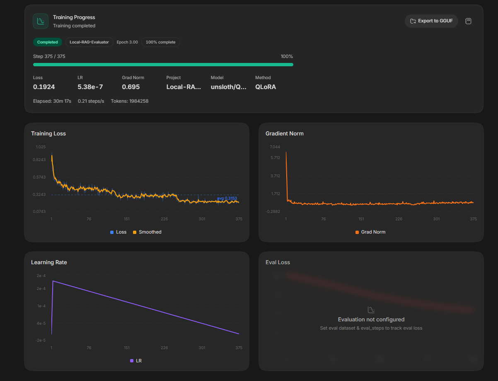

# Local-RAG-Evaluator

A distilled, local-first RAG evaluation pipeline that replaces cloud API judges with a fine-tuned student model — delivering strict JSON schema outputs at zero marginal cost.

---

## Table of Contents

- [The Problem](#the-problem)
- [The Solution](#the-solution)
- [Architecture Overview](#architecture-overview)
- [Dataset Generation & Teacher Distillation](#dataset-generation--teacher-distillation)
  - [Teacher Model](#teacher-model)
  - [Evaluation Schema](#evaluation-schema)
  - [Dataset Pivot & Balancing](#dataset-pivot--balancing)
  - [Distillation Pipeline](#distillation-pipeline)
- [Training Configuration & Results](#training-configuration--results)
  - [Base Model](#base-model)
  - [Training Configuration](#training-configuration)
  - [LoRA Configuration](#lora-configuration)
  - [Training Results](#training-results)
  - [Training Dashboard](#training-dashboard)
  - [GGUF Export & Ollama Serving](#gguf-export--ollama-serving)
- [Usage](#usage)
  - [Prerequisites](#prerequisites)
  - [Generate the Dataset](#1-generate-the-dataset)
  - [Validate the Dataset](#2-validate-the-dataset)
  - [Fine-Tune with Unsloth Studio](#3-fine-tune-with-unsloth-studio)
  - [Export & Serve with Ollama](#4-export--serve-with-ollama)
- [File Structure](#file-structure)
- [Hardware Requirements](#hardware-requirements)
- [License](#license)

---

## The Problem

Local base LLMs (such as Qwen 4B or 9B) possess the baseline reasoning required to evaluate Retrieval-Augmented Generation (RAG) triplets, but they fail to reliably output **strict, nested JSON schemas** in a zero-shot setting. They frequently require multi-turn prompting to drop conversational filler and conform to structured formats.

Relying on cloud APIs (OpenAI, Gemini) for bulk evaluation solves the formatting issue but introduces **latency** and **cost** — especially when evaluating hundreds or thousands of RAG responses at scale.

## The Solution

This project distills the reasoning and strict JSON formatting capabilities of **Gemini 3.8 Flash** into a fast, local student model via **Unsloth QLoRA**. The resulting fine-tuned model acts as a **local judge**, accurately outputting a strict Pydantic JSON schema to evaluate RAG pipelines in a single turn — with **zero API costs** and full data privacy.

---

## Architecture Overview

```
┌──────────────────────┐     ┌───────────────────────┐     ┌─────────────────┐
│   PatronusAI/HaluBench │────▶│  generate_dataset.py  │────▶│  rag_judge_     │
│   (Teacher Data)       │     │  (Gemini 3.8 Flash)   │     │  distilled_     │
└──────────────────────┘     └───────────────────────┘     │  dataset.jsonl    │
                                                            └────────┬────────┘
                                                                      │
                                                          ┌───────────▼──────────┐
                                                          │ Unsloth Studio QLoRA  │
                                                          │ (Qwen3.5-4B Student) │
                                                          └───────────┬──────────┘
                                                                      │
                                                          ┌───────────▼──────────┐
                                                          │ GGUF Export           │
                                                          │ (Q4_K_M Quantized)    │
                                                          └───────────┬──────────┘
                                                                      │
                                                          ┌───────────▼──────────┐
                                                          │ Ollama Serve          │
                                                          │ (Local Judge Endpoint)│
                                                          └──────────────────────┘
```

---

## Dataset Generation & Teacher Distillation

### Teacher Model

All training data is generated using **Gemini 3.8 Flash** via the `google-genai` Python SDK. The API's native `response_schema` parameter binds outputs to a strict Pydantic model (`RAGEvaluation`), guaranteeing perfectly structured JSON responses every time — no prompt engineering tricks required.

### Evaluation Schema

The teacher model scores each RAG triplet across three dimensions on a **1–5 scale**, with required reasoning strings for each metric:

| Field                | Type     | Description                                                  |
|----------------------|----------|--------------------------------------------------------------|
| `context_relevance`  | `MetricScore` | Relevance of retrieved context to the query (score + reasoning) |
| `groundedness`       | `MetricScore` | How well the answer is supported by the context (score + reasoning) |
| `answer_relevance`   | `MetricScore` | How directly the answer addresses the query (score + reasoning) |
| `hallucination_flag` | `bool`   | `true` if the answer introduces ungrounded factual claims    |

```python
class MetricScore(BaseModel):
    score: int = Field(..., description="Integer score between 1 and 5")
    reasoning: str = Field(..., description="Short explanation justifying the assigned score")

class RAGEvaluation(BaseModel):
    context_relevance: MetricScore
    groundedness: MetricScore
    answer_relevance: MetricScore
    hallucination_flag: bool
```

### Dataset Pivot & Balancing

Initial testing with `neural-bridge/rag-dataset-12000` resulted in **score collapse** — the teacher model assigned near-perfect scores (all 5s) because the dataset lacked meaningful negative examples.

The project pivoted to **PatronusAI/HaluBench**, a dataset specifically designed for hallucination evaluation. HaluBench contains real-world data including FinanceBench SEC filings, making it ideal for training a model that can distinguish truthful from hallucinated answers.

**Balancing strategy:**
- Extracts the `test` split of HaluBench
- Filters exactly **500 PASS** (truthful) rows and **500 FAIL** (hallucinated) rows
- Guarantees a perfectly balanced 1:1 scoring distribution across 1,000 total samples

### Distillation Pipeline

The distillation script (`generate_dataset.py`):

1. Loads and balances the HaluBench test split
2. Truncates contexts to **6,000 characters** to cap API token spend (safety limit against large FinanceBench documents)
3. Queries Gemini with `temperature=0.0` for deterministic outputs
4. Formats each example into **Alpaca standard** (`instruction`, `input`, `output`)
5. Saves rows **instantly to disk** after each successful API call — preventing data loss on interruption

The result is a **1,000-row training file** with guaranteed schema compliance and balanced labels, ready for Unsloth Studio fine-tuning.

---

## Training Configuration & Results

### Base Model

| Parameter | Value |
|-----------|-------|
| **Model** | Qwen3.5-4B |
| **Framework** | Unsloth (QLoRA) |
| **Quantization** | 4-bit (NF4) |
| **Dataset** | `rag_judge_distilled_dataset.jsonl` (JSONL, Alpaca format) |

### Training Configuration

| Parameter | Value |
|-----------|-------|
| Epochs | 3 |
| Context length | 4,096 tokens |
| Learning rate | 2 × 10⁻⁴ |
| Batch size | 2 |
| Gradient accumulation steps | 4 |
| **Effective batch size** | 8 |
| Optimizer | AdamW 8-bit |
| LR scheduler | Linear decay |
| Weight decay | 0.001 |

### LoRA Configuration

| Parameter | Value |
|-----------|-------|
| Method | QLoRA (rank-adaptation) |
| LoRA rank (`r`) | 16 |
| LoRA alpha | 32 |
| LoRA dropout | 0.00 |
| Target modules | `q_proj`, `k_proj`, `v_proj`, `o_proj`, `gate_proj`, `up_proj`, `down_proj` |

### Training Results

- **Status:** Completed (100%)
- **Total steps:** 375 / 375
- **Total tokens processed:** 1,984,258
- **Training duration:** 30 min 17 sec
- **Training speed:** 0.21 steps/sec
- **Final loss:** 0.1924
- **Final gradient norm:** 0.695
- **Final learning rate:** 5.38 × 10⁻⁷

**Loss curve behavior:** Training loss starts at ~0.9 and drops rapidly during early steps, then gradually trends downward with fluctuations, finishing around 0.2–0.3 (smoothed loss: ~0.3153). The linear LR scheduler produces a clean decay from 2×10⁻⁴ down to near-zero by epoch 3.

### Training Dashboard



The dashboard captures the full training run: loss drops rapidly in early steps and stabilizes below 0.2, learning rate follows the expected linear decay from 2×10⁻⁴ to near-zero, and gradient norms settle quickly before remaining stable throughout training.

### GGUF Export & Ollama Serving

The trained LoRA adapter weights were merged and exported to `.gguf` format (Q4_K_M quantization) for local inference with compatible runtimes such as Ollama, llama.cpp, or Hugging Face `transformers`.

The exported GGUF file is imported into **Ollama** using a custom `Modelfile` that enforces the correct chat template and inference parameters, allowing the evaluator to be served as a local endpoint for real-time RAG evaluation.

---

## Usage

### Prerequisites

```bash
pip install google-genai pydantic datasets tqdm
```

Additional packages required for fine-tuning: `unsloth`, `torch`, `trl` (see [Unsloth Studio](https://docs.unsloth.ai)).

### 1. Generate the Dataset

Set your Gemini API key and run the distillation script:

```bash
export GEMINI_API_KEY="your-api-key-here"
python generate_dataset.py
```

The script will:
- Load and balance the HaluBench dataset
- Generate evaluations via Gemini 3.8 Flash with automatic exponential backoff on rate limits (HTTP 429)
- Save the output to `rag_judge_distilled_dataset.jsonl`

### 2. Validate the Dataset

Verify dataset integrity, schema adherence, and score distribution:

```bash
python validate_dataset.py
```

This script:
- Asserts all rows conform to the Alpaca template structure (`instruction`, `input`, `output`)
- Parses each output as JSON and validates Pydantic schema adherence
- Prints groundedness score distribution (1–5) and hallucination flag counts
- Displays a random sample output for visual inspection

### 3. Fine-Tune with Unsloth Studio

Upload `rag_judge_distilled_dataset.jsonl` to [Unsloth Studio](https://studio.unsloth.com/) and fine-tune a Qwen 3.5 4B base model using the configuration below:

**Recommended hyperparameters (tested on RTX 5060 Ti 16GB):**
- **Epochs:** 3 · **Context length:** 4,096 · **LR:** 2e-4
- **Effective batch size:** 8 (batch=2, grad_accum=4)
- **LoRA:** rank=16, alpha=32, dropout=0, targets=all linear + MLP modules
- **Optimizer:** AdamW 8-bit · **Scheduler:** Linear decay · **Weight decay:** 0.001

> These settings produced a final training loss of 0.1924 in ~30 minutes on consumer hardware.

### 4. Export & Serve with Ollama

After training:
1. Merge the LoRA adapter weights
2. Export to GGUF format (Q4_K_M quantization)
3. Create an Ollama `Modelfile` pointing to the exported `.gguf`
4. Run `ollama create local-rag-judge && ollama run local-rag-judge`

---

## File Structure

```
Local-RAG-Evaluator/
├── generate_dataset.py              # Primary distillation script: dataset balancing, Gemini API calls, exponential backoff, instant disk writes
├── validate_dataset.py              # Data pipeline sanity check: validates Alpaca keys, JSON schema adherence, score distribution, hallucination balance
├── rag_judge_distilled_dataset.jsonl  # Final 1,000-row perfectly balanced training artifact (500 PASS + 500 FAIL)
├── Modelfile                        # Ollama configuration: GGUF model path, chat template, and inference parameters
└── README.md                        # This file
```

### Component Descriptions

| File | Purpose |
|------|---------|
| **`generate_dataset.py`** | The primary generation script. Handles dataset split balancing, context truncation (6K char safety limit), and Gemini SDK calls with `HttpRetryOptions` for automatic exponential backoff on HTTP 429/5xx errors. Saves rows to disk immediately after each successful API call. |
| **`validate_dataset.py`** | A data pipeline sanity-check script. Reads the generated `.jsonl`, asserts the presence of Alpaca keys and valid JSON schemas, and prints the distribution of 1–5 scores and hallucination flags to visually verify the dataset is unbiased prior to Unsloth training. |
| **`rag_judge_distilled_dataset.jsonl`** | The final 1,000-row, perfectly balanced training artifact formatted in Alpaca standard for Unsloth Studio QLoRA fine-tuning. |
| **`Modelfile`** | The configuration document used by Ollama to read the GGUF model and initialize the local server endpoint with the correct chat template and parameters. |

---

## Hardware Requirements

| Stage | Minimum | Tested On |
|-------|---------|-----------|
| Dataset Generation | Any machine with internet access (CPU) | — |
| Fine-Tuning (QLoRA 4-bit) | 8 GB VRAM | NVIDIA RTX 5060 Ti 16GB (~30 min, 3 epochs) |
| Inference (GGUF Q4_K_M) | 6 GB RAM | — |

> **Note:** The fine-tuning configuration was tested on an NVIDIA GeForce RTX 5060 Ti with ~15.9 GB VRAM available. Unsloth's memory optimizations (4-bit NF4 quantization + QLoRA) make consumer GPUs viable for distilling capable teacher models.

---

## License

This project is released for educational and research purposes. Dataset usage is subject to the terms of the [PatronusAI/HaluBench](https://huggingface.co/datasets/PatronusAI/HaluBench) dataset license.
