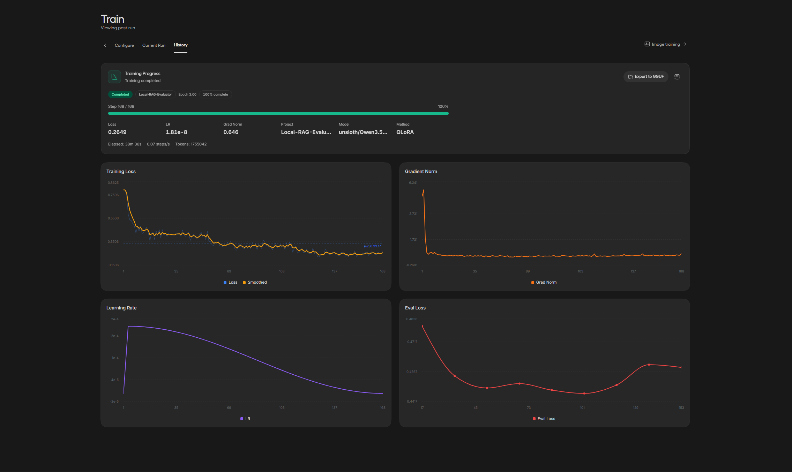
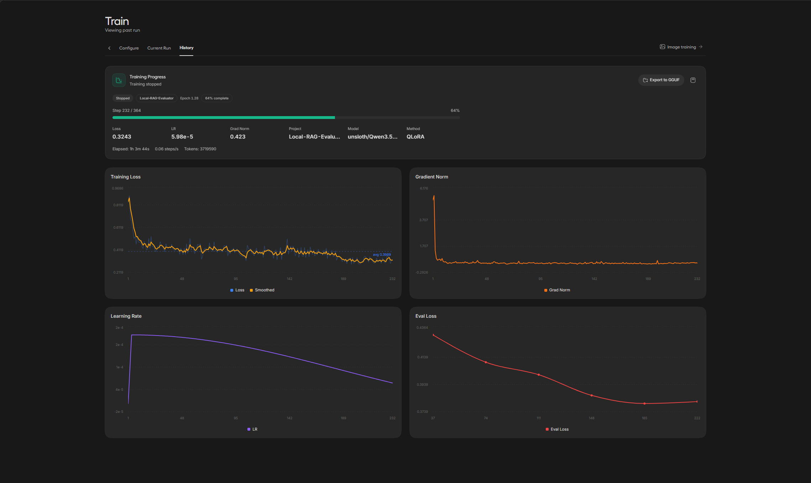
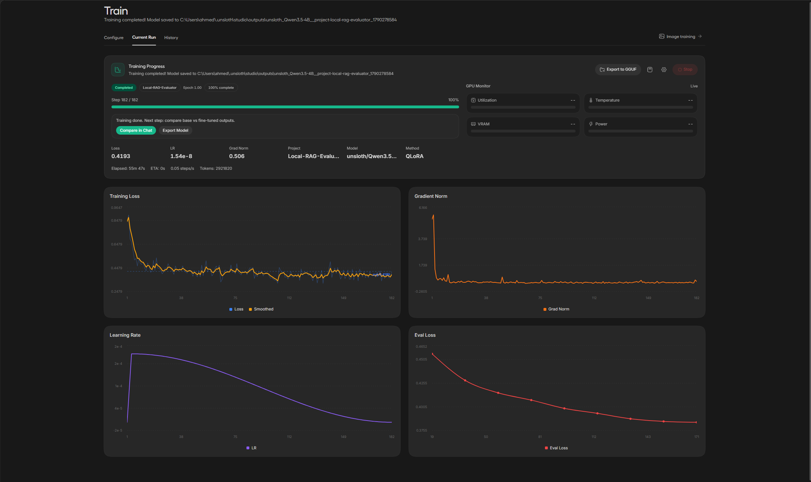
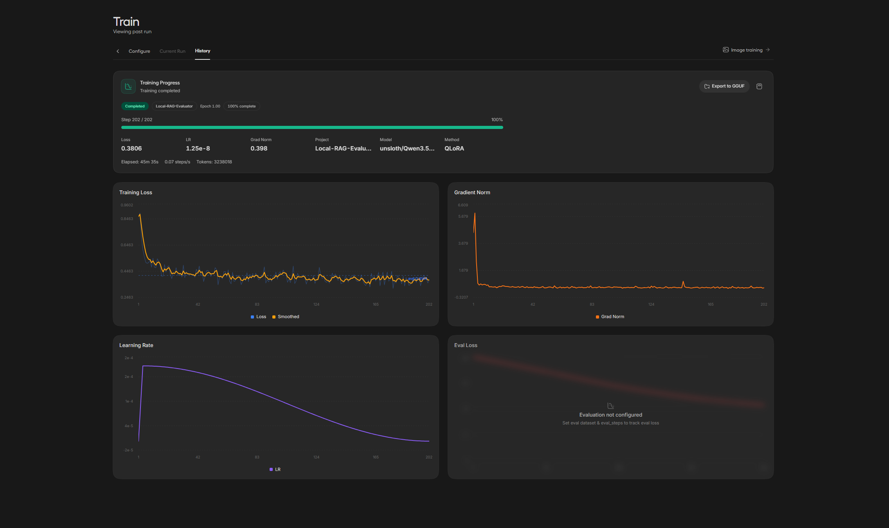

# Local-RAG-Evaluator

A distilled, local-first RAG evaluation pipeline that replaces cloud API judges with a fine-tuned student model — delivering strict JSON schema outputs at zero marginal cost.

---

## Table of Contents

- [The Problem](#the-problem)
- [The Solution](#the-solution)
- [Architecture Overview](#architecture-overview)
- [Dataset Generation & Teacher Distillation](#dataset-generation--teacher-distillation)
  - [Teacher Model](#teacher-model)
  - [Evaluation Schema](#evaluation-schema)
  - [Dataset Pivot & Balancing](#dataset-pivot--balancing)
  - [Distillation Pipeline](#distillation-pipeline)
  - [Final Dataset Profile](#final-dataset-profile)
- [Training Configuration & Iteration History](#training-configuration--iteration-history)
  - [Base Model](#base-model)
  - [Shared Hyperparameters](#shared-hyperparameters)
  - [LoRA Configuration](#lora-configuration)
  - [Run 1 — 3 Epochs on the 1k Pilot (Overfitting Exposed)](#run-1--3-epochs-on-the-1k-pilot-overfitting-exposed)
  - [Run 2 — 2 Epochs on the Expanded Dataset (Stopped Early)](#run-2--2-epochs-on-the-expanded-dataset-stopped-early)
  - [Run 3 — 1 Epoch with Eval Monitoring (Validated)](#run-3--1-epoch-with-eval-monitoring-validated)
  - [Run 4 — Final Model (Full Dataset, No Holdout)](#run-4--final-model-full-dataset-no-holdout)
  - [What the Runs Taught](#what-the-runs-taught)
  - [GGUF Export & Ollama Serving](#gguf-export--ollama-serving)
- [Usage](#usage)
  - [Prerequisites](#prerequisites)
  - [1. Generate the Pilot Dataset (~1k)](#1-generate-the-pilot-dataset-1k)
  - [2. Expand & Merge to the Full Dataset (~3.2k)](#2-expand--merge-to-the-full-dataset-32k)
  - [3. Validate the Dataset](#3-validate-the-dataset)
  - [4. Split Train / Eval](#4-split-train--eval)
  - [5. Fine-Tune with Unsloth Studio](#5-fine-tune-with-unsloth-studio)
  - [6. Export & Serve with Ollama](#6-export--serve-with-ollama)
- [File Structure](#file-structure)
- [Hardware Requirements](#hardware-requirements)
- [License](#license)

---

## The Problem

Local base LLMs (such as Qwen 4B or 9B) possess the baseline reasoning required to evaluate Retrieval-Augmented Generation (RAG) triplets, but they fail to reliably output **strict, nested JSON schemas** in a zero-shot setting. They frequently require multi-turn prompting to drop conversational filler and conform to structured formats.

Relying on cloud APIs (OpenAI, Gemini) for bulk evaluation solves the formatting issue but introduces **latency** and **cost** — especially when evaluating hundreds or thousands of RAG responses at scale.

## The Solution

This project distills the reasoning and strict JSON formatting capabilities of **Gemini 3.8 Flash** into a fast, local student model via **Unsloth QLoRA**. The resulting fine-tuned model acts as a **local judge**, accurately outputting a strict Pydantic JSON schema to evaluate RAG pipelines in a single turn — with **zero API costs** and full data privacy.

---

## Architecture Overview

```
PatronusAI/HaluBench (test split, PASS/FAIL labels)
        │
        ├──▶ scripts/01_distill_pilot_1k.py ──────────▶ ~1k rows (pilot dataset)
        │        (Gemini 3.8 Flash teacher, schema-bound)
        │
        └──▶ scripts/02_distill_expansion_3k.py ─────▶ expansion rows
                 (Gemini 3.8 Flash teacher, deduped vs pilot)
                                │
                                ▼
              data/combined_dataset_3k.jsonl   (~3,230 rows, merged)
                                │
                                ▼
              data/split_dataset.py  (seed 42, 90/10 split)
                   ┌─────────────┴─────────────┐
                   ▼                           ▼
     data/train_split.jsonl          data/eval_split.jsonl
     (2,907 rows · 90%)             (323 rows · 10%)
                   │                           │
                   └─────────────┬─────────────┘
                                 ▼
           Unsloth Studio QLoRA (Qwen3.5-4B student)
           1 epoch · effective batch 16 · eval-monitored
                                 │
                                 ▼
           GGUF export (Q4_K_M) ──▶ Ollama serve (local judge endpoint)
```

---

## Dataset Generation & Teacher Distillation

### Teacher Model

All training data is generated using **Gemini 3.8 Flash** via the `google-genai` Python SDK. The API's native `response_schema` parameter binds outputs to a strict Pydantic model (`RAGEvaluation`), guaranteeing perfectly structured JSON responses every time — no prompt engineering tricks required.

### Evaluation Schema

The teacher model scores each RAG triplet across three dimensions on a **1–5 scale**, with required reasoning strings for each metric:

| Field                | Type     | Description                                                  |
|----------------------|----------|--------------------------------------------------------------|
| `context_relevance`  | `MetricScore` | Relevance of retrieved context to the query (score + reasoning) |
| `groundedness`       | `MetricScore` | How well the answer is supported by the context (score + reasoning) |
| `answer_relevance`   | `MetricScore` | How directly the answer addresses the query (score + reasoning) |
| `hallucination_flag` | `bool`   | `true` if the answer introduces ungrounded factual claims    |

```python
class MetricScore(BaseModel):
    score: int = Field(..., description="Integer score between 1 and 5")
    reasoning: str = Field(..., description="Short explanation justifying the assigned score")

class RAGEvaluation(BaseModel):
    context_relevance: MetricScore
    groundedness: MetricScore
    answer_relevance: MetricScore
    hallucination_flag: bool
```

### Dataset Pivot & Balancing

Initial testing with `neural-bridge/rag-dataset-12000` resulted in **score collapse** — the teacher model assigned near-perfect scores (all 5s) because the dataset lacked meaningful negative examples.

The project pivoted to **PatronusAI/HaluBench**, a dataset specifically designed for hallucination evaluation. HaluBench contains real-world data including FinanceBench SEC filings, making it ideal for training a model that can distinguish truthful from hallucinated answers.

**Balancing strategy:**
- Pilot: extracts the `test` split of HaluBench and takes exactly **500 PASS** (truthful) + **500 FAIL** (hallucinated) rows → ~1k balanced pilot dataset
- Expansion: targets the **next 1,500 PASS + 1,500 FAIL** rows (offset indices `[500:2000]` per label) so no row is reused, and deduplicates against the pilot file by exact prompt match before any API call
- **Why the combined dataset is ~3.2k and not 4k:** Google account's balance was depleted mid generation resulting in the dataset ending at 3.2k and not 4k.

### Distillation Pipeline

The distillation scripts (`scripts/01_distill_pilot_1k.py`, `scripts/02_distill_expansion_3k.py`):

1. Load and balance the HaluBench test split
2. Truncate contexts to **6,000 characters** to cap API token spend (safety limit against large FinanceBench documents)
3. Query Gemini with `temperature=0.0` for deterministic outputs
4. Format each example into **Alpaca standard** (`instruction`, `input`, `output`)
5. Save rows **instantly to disk** after each successful API call — preventing data loss on interruption
6. Automatic exponential backoff on rate limits (HTTP 429/5xx) via `HttpRetryOptions`

### Final Dataset Profile

The merged dataset (`data/combined_dataset_3k.jsonl`, pilot + expansion concatenated) was measured before training:

- **3,230 rows**, all conforming to the Alpaca template and Pydantic schema (0 corrupted)
- Split 90/10 by `data/split_dataset.py` (seed 42): **2,907 train / 323 eval**
- Hallucination flag: **1,714 True / 1,516 False** — HaluBench's PASS/FAIL labels balance the *inputs*.
- Score distributions: `context_relevance` is top-heavy (87% fives — retrieved passages are usually on-topic even when answers hallucinate), `groundedness` is bimodal (peaks at 1 and 5), `answer_relevance` spreads across all of 1–5
- Strong internal consistency: `hallucination_flag=true` concentrates in groundedness scores 1–2 (839 + 583 rows), while `flag=false` concentrates at 5 (1,307 rows)

---

## Training Configuration & Iteration History

### Base Model

| Parameter | Value |
|-----------|-------|
| **Model** | Qwen3.5-4B (`unsloth/Qwen3.5-4B`) |
| **Framework** | Unsloth Studio (QLoRA) |
| **Quantization** | 4-bit (NF4) |
| **Dataset** | Alpaca JSONL (see [Final Dataset Profile](#final-dataset-profile)) |

### Shared Hyperparameters

Every run used identical settings — only the epoch count changed:

| Parameter | Value |
|-----------|-------|
| Epochs | varied per run (3 → 2 → 1), see below |
| Context length | 4,096 tokens |
| Learning rate | 2 × 10⁻⁴ (warmup + linear decay to ~0) |
| Batch size | 2 |
| Gradient accumulation steps | 8 |
| **Effective batch size** | 16 |
| Optimizer | AdamW 8-bit |
| LR scheduler | Linear decay |
| Weight decay | 0.001 |

### LoRA Configuration

| Parameter | Value |
|-----------|-------|
| Method | QLoRA (rank-adaptation) |
| LoRA rank (`r`) | 16 |
| LoRA alpha | 32 |
| LoRA dropout | 0.00 |
| Target modules | `q_proj`, `k_proj`, `v_proj`, `o_proj`, `gate_proj`, `up_proj`, `down_proj` |

### Run 1 — 3 Epochs on the 1k Pilot (Overfitting Exposed)

Trained on the ~1k pilot dataset with a held-out eval split.

- **Completed:** 168 / 168 steps · 1,755,042 tokens · 38 min 36 s
- **Final train loss:** 0.2649 (run average ≈ 0.3377) · LR decayed to 1.81 × 10⁻⁸ · final grad norm 0.646
- **Eval loss:** started ~0.48, dropped to a minimum of **~0.442–0.445 around steps 50–105**, then climbed back to **~0.46** by the end — the classic overfitting signature: training loss keeps falling while eval performance degrades after epoch 1



### Run 2 — 2 Epochs on the Expanded Dataset (Stopped Early)

Trained on `train_split.jsonl` (2,907 rows) with `eval_split.jsonl` (323 rows) for monitoring.

- **Stopped at step 232 / 364** (epoch 1.28, 64%) — halted the moment the eval curve turned up
- **At stop:** loss 0.3243 · LR 5.98 × 10⁻⁵ · grad norm 0.423
- **Eval loss:** ~0.4364 → steady decline to a minimum of **~0.379 at step ~185** (end of epoch 1) → slight uptick by ~step 222



### Run 3 — 1 Epoch with Eval Monitoring (Validated)

Same data, one full epoch.

- **Completed:** 182 / 182 steps · 2,921,820 tokens · 55 min 47 s
- **Final train loss:** 0.4193 · LR decayed to 1.54 × 10⁻⁸ · final grad norm 0.506
- **Eval loss:** steadily decreasing throughout — ~0.46 → ~0.43 → ~0.42 → ~0.41 → ~0.40 → ~0.39 → **~0.382** at the final checkpoint, flattening near the end with no divergence



### Run 4 — Final Model (Full Dataset, No Holdout)

Trained on the **entire** `combined_dataset_3k.jsonl` (3,230 rows) for 1 epoch with **no eval holdout** — every row goes into the final weights. This produces the shipped model.

- **Completed:** 202 / 202 steps · 3,238,018 tokens · 45 min 35 s
- **Final train loss:** 0.3806 (loss plateaus near ~0.38) · LR decayed to 1.25 × 10⁻⁸ · final grad norm 0.398
- **Eval split: not configured** — by design, since the full dataset was used there is no held-out set; run health is inferred from Run 3's monotonically decreasing eval curve under identical settings



### What the Runs Taught

- **Training loss alone is misleading.** Run 1's low train loss masked severe overfitting; only a held-out eval split exposed it.
- **More data does not license more epochs.** Even with ~3× the rows, 2 epochs still overfit — caught at epoch ~1.3 in Run 2.
- **1 epoch + eval monitoring is the validated setting** for this dataset: monotonically decreasing held-out eval loss (Run 3).
- The final model extrapolates from Run 3's healthy curve, trained on the full dataset so no data is wasted — its final loss (0.3806) lands just below Run 3's (0.4193), consistent with a healthy single-epoch run.


### GGUF Export & Ollama Serving

The trained LoRA adapter weights are merged and exported to `.gguf` format (Q4_K_M quantization) for local inference with compatible runtimes such as Ollama, llama.cpp, or Hugging Face `transformers`.

The exported GGUF file is imported into **Ollama** using a custom `Modelfile` that enforces the correct chat template and inference parameters, allowing the evaluator to be served as a local endpoint for real-time RAG evaluation.

---

## Usage

### Prerequisites

```bash
pip install google-genai pydantic datasets tqdm
```

Additional packages required for fine-tuning: `unsloth`, `torch`, `trl` (see [Unsloth Studio](https://docs.unsloth.ai)).

### 1. Generate the Pilot Dataset (~1k)

Set your Gemini API key and run the pilot distillation script:

```bash
export GEMINI_API_KEY="your-api-key-here"
python scripts/01_distill_pilot_1k.py
```

This balances 500 PASS + 500 FAIL HaluBench rows, distills them via Gemini 3.8 Flash with automatic exponential backoff on rate limits (HTTP 429), and saves `rag_judge_distilled_dataset.jsonl`.

### 2. Expand & Merge to the Full Dataset (~3.2k)

```bash
python scripts/02_distill_expansion_3k.py
```

This distills the next 1,500 PASS + 1,500 FAIL rows (offset from the pilot, capped by the available label balance), skipping any prompt already present in the pilot file, and saves `rag_judge_distilled_dataset_3k.jsonl`. Concatenate both files into `data/combined_dataset_3k.jsonl` (~3,230 rows).

### 3. Validate the Dataset

```bash
python scripts/03_validate_dataset.py data/combined_dataset_3k.jsonl
```

This asserts Alpaca template structure, validates Pydantic schema adherence on every row, reports score distributions (1–5) and hallucination flag counts, flags duplicate prompts, and prints a random sample for visual inspection.

### 4. Split Train / Eval

```bash
python data/split_dataset.py
```

Seeded shuffle (seed 42) + 90/10 split → `data/train_split.jsonl` (2,907 rows) and `data/eval_split.jsonl` (323 rows).

### 5. Fine-Tune with Unsloth Studio

Upload `train_split.jsonl` as the training set and `eval_split.jsonl` as the eval set, and fine-tune the Qwen3.5-4B base model. Watch the **eval loss curve** — it is what caught the overfitting in Runs 1–2.

**Validated configuration (tested on RTX 5060 Ti 16GB):**
- **Epochs:** 1 · **Context length:** 4,096 · **LR:** 2e-4
- **Batch size:** 2 · **Gradient accumulation:** 8 → **effective batch size 16**
- **LoRA:** rank=16, alpha=32, dropout=0, targets=all linear + MLP modules
- **Optimizer:** AdamW 8-bit · **Scheduler:** Linear decay · **Weight decay:** 0.001

> One epoch on the 2,907-row train split completes in ~56 minutes and produced a steadily decreasing eval loss (~0.46 → ~0.382). Do not exceed 1–2 epochs on this data size: both larger counts were observed to overfit.

### 6. Export & Serve with Ollama

After training:
1. Merge the LoRA adapter weights
2. Export to GGUF format (Q4_K_M quantization)
3. Create an Ollama `Modelfile` pointing to the exported `.gguf`
4. Run `ollama create local-rag-judge && ollama run local-rag-judge`

---

## File Structure

```
Local-RAG-Evaluator/
├── scripts/
│   ├── 01_distill_pilot_1k.py        # Pilot distillation: 500 PASS + 500 FAIL → ~1k Alpaca rows
│   ├── 02_distill_expansion_3k.py    # Expansion distillation: next 1,500+1,500 rows (capped by label balance), deduped vs pilot
│   └── 03_validate_dataset.py        # Sanity check: Alpaca keys, JSON schema, score distributions, duplicates
├── data/
│   ├── split_dataset.py              # Seeded 90/10 train/eval split of the combined dataset
│   ├── combined_dataset_3k.jsonl     # Merged distilled dataset (3,230 rows)
│   ├── train_split.jsonl             # Training set (2,907 rows)
│   └── eval_split.jsonl              # Eval set (323 rows)
├── images/
│   ├── 3-epochs-1k-overfit.png       # Run 1 dashboard: eval loss bottoms out then climbs
│   ├── 2-epochs-run.png              # Run 2 dashboard: stopped at epoch 1.28, eval uptick
│   ├── 1-epoch-run.png               # Run 3 dashboard: completed, eval loss steadily decreasing
│   └── final-run.png                 # Run 4 dashboard: completed on the full dataset, no eval configured
└── README.md
```

---

## Hardware Requirements

| Stage | Minimum | Tested On |
|-------|---------|-----------|
| Dataset Generation | Any machine with internet access (CPU) | — |
| Fine-Tuning (QLoRA 4-bit) | 8 GB VRAM | NVIDIA RTX 5060 Ti 16GB (~56 min per epoch on the 2,907-row train split) |
| Inference (GGUF Q4_K_M) | 6 GB RAM | — |

> **Note:** The fine-tuning configuration was tested on an NVIDIA GeForce RTX 5060 Ti with ~15.9 GB VRAM available. Unsloth's memory optimizations (4-bit NF4 quantization + QLoRA) make consumer GPUs viable for distilling capable teacher models.

---

## License

This project is released for educational and research purposes. Dataset usage is subject to the terms of the [PatronusAI/HaluBench](https://huggingface.co/datasets/PatronusAI/HaluBench) dataset license.
